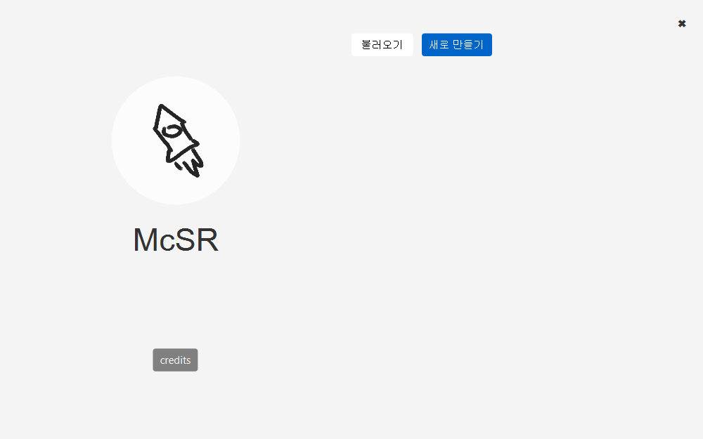

# McSR
Minecraft Server Runner Program. Written in Kotlin (GUI + CLI)

## 공지
이 프로젝트는 [qogusdn1017](https://github.com/qogusdn1017) 님의 [McSR](https://github.com/qogusdn1017/McSR) 프로젝트의 포크 버전입니다.

## 스크린샷

> 나머지는 [여기](docs/screenshots.md)

## 의존성
- [kotlinx.serialization](https://github.com/Kotlin/kotlinx.serialization)
- [kotlinx.coroutines](https://github.com/Kotlin/kotlinx.coroutines)

## McSRC
McSRC는 서버스크립트의 종류( [aroxu/server-script](https://github.com/aroxu/server-script), [monun/server-script](https://github.com/monun/server-script) )와 상관없이 스크립트 설정만을 담은 파일 형식입니다. `ConfigSerializer`을 이용해 api의 `McSRConfig` 객체로 변환할 수 있습니다. `server-script` config 파일이 바이너리 일 때, `mcsrc`는 바이트코드 비슷한 것이라고 이해하면 쉽습니다.

## Runner
Runner은 `mcsrc`를 jar 파일 내부에 내장해 서버 스크립트를 웹에서 다운로드 받고 실행시켜주는 실행기입니다.

## 실행
GUI나 CLI를 이용해 원하는 설정을 가진 서버를 배포할 수 있습니다. `mcsrc`로 배포하는 경우, 배포하는 대상은 McSR을 이용하여 실행기를 직접 배포해야합니다. 반면에, `runner` 형태로 배포하는 경우, 배포 대상은 `runner`를 직접 실행할 수 있습니다. 

## 라이선스
MIT License

## 빌드하기
이 프로젝트는 GUI 시스템이 JavaFX를 이용하므로, JavaFX 런타임이 따로 필요합니다.
매번 설치하는 번거로움을 피하기 위해, JLink를 이용해 플랫폼별 네이티브 앱 형태로 배포합니다. 

```
> ./gradlew binary
```
를 실행하고, `mcsr/builds/mcsr-bin.zip`을 압축해제합니다. 그후, 압축 해제된 폴더의 `bin/McSR`(윈도우의 경우 `bin/McSR.bat`)을 실행하여 앱을 실행할 수 있습니다. 또는, 이를 바로가기를 이용하거나, 시스템 환경변수에 추가해 쉽게 접근할 수 있습니다.

## CLI 개발하기
개발하는 방법은 [CLI 개발하기](docs/cli.md) 를 참고하세요.